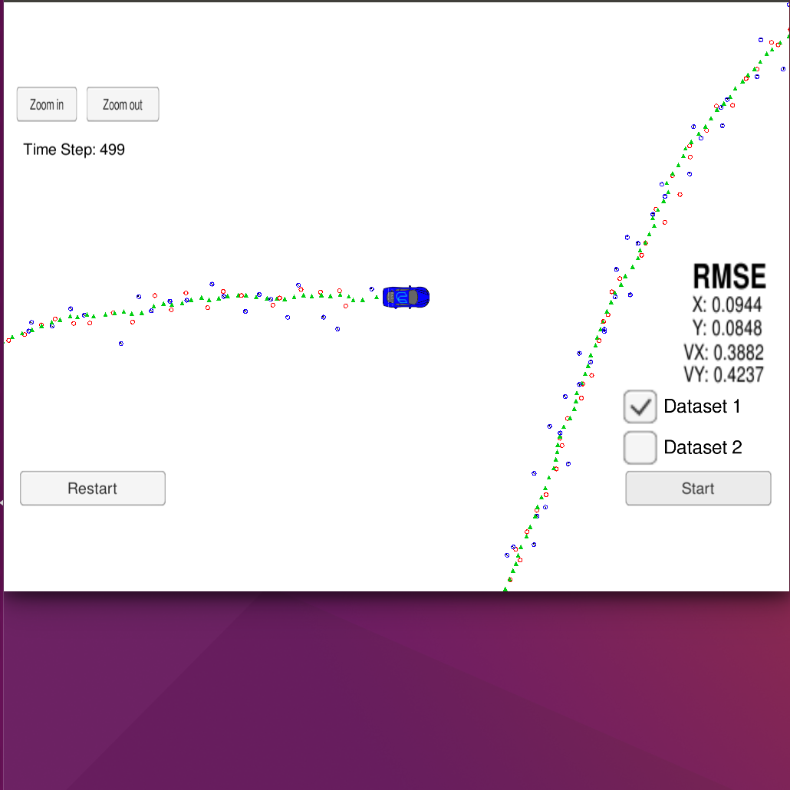
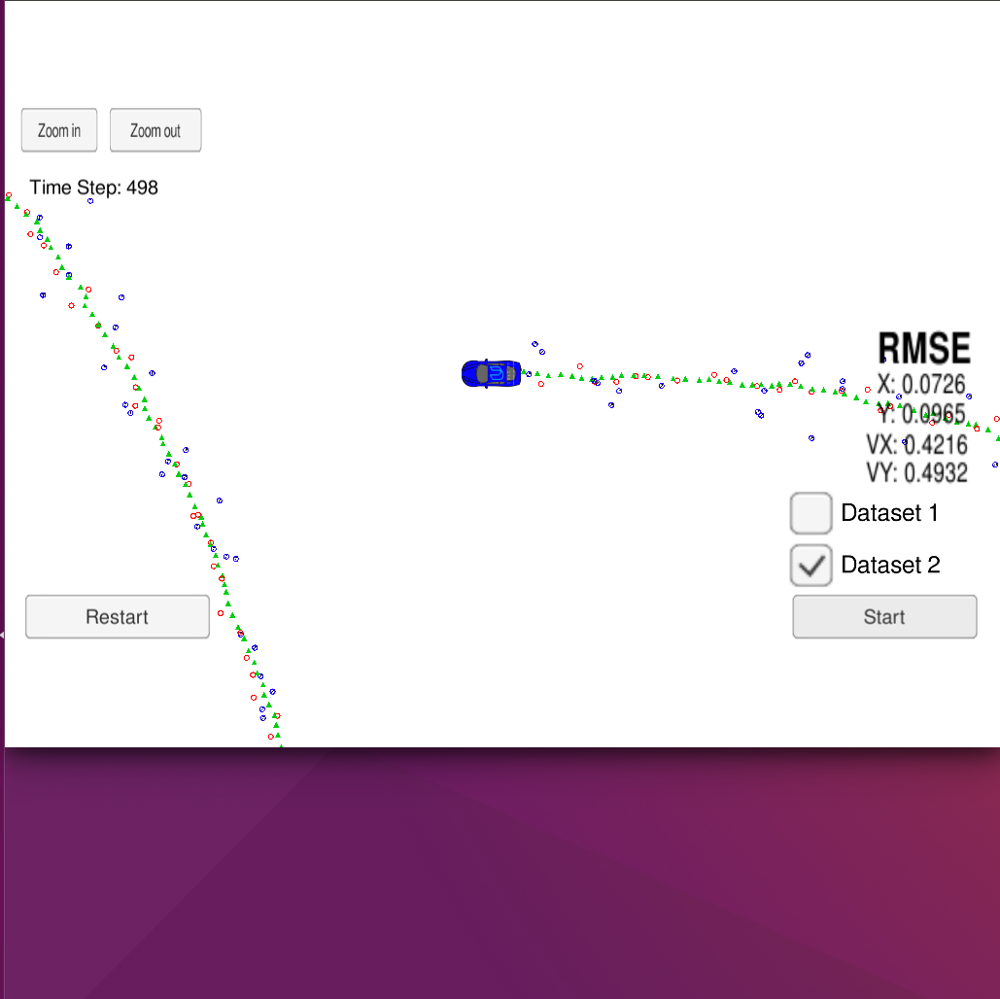

# Extended_Kalman-FIlter
## Rubric points
# Compiling
# Your code should compile

The code compiles without errors.

# Accuracy
px, py, vx, vy output coordinates must have an RMSE <= [.11, .11, 0.52, 0.52] when using the file: "obj_pose-laser-radar-synthetic-input.txt which is the same data file the simulator uses for Dataset 1"

The EKF accuracy was:

    Dataset 1 : RMSE <= 
    
    Dataset 2 : RMSE <= 
    

# Following the Correct Algorithm
Your Sensor Fusion algorithm follows the general processing flow as taught in the preceding lessons.

The Kalman filter implementation can be found src/kalman_filter.cpp and it is used to predict at src/FusionEKF.cpp

The predict operation could be found at src/FusionEKF.cpp, the update operation also the same file.
